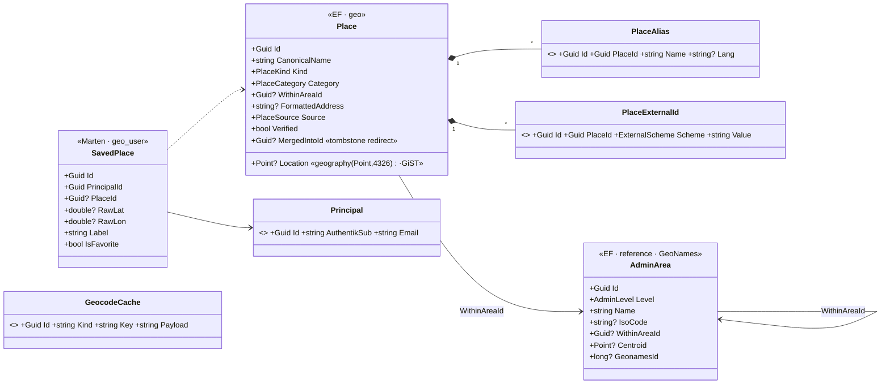

# Architecture

LupiraGeoApi is the geo/gazetteer bounded context for Lupira: a shared catalog of real-world **places** with
coordinates and an administrative containment tree, **geocoding** (forward + reverse), and per-principal **saved
places**. Other services (starting with LupiraCalApi) reference a place by id and resolve free-text locations through
it. It is the long-term home for a Google-Maps-style capability, so spatial storage (PostGIS) is built in from the
start.

## Bounded context & layering

Two projects, split on the architectural boundary (same shape as the other Lupira APIs):

- **`LupiraGeoApi.Core`** — the bounded context. Domain types, the EF `GeoDbContext`, transport-neutral application
  services, DTOs, mappers. No ASP.NET dependency.
- **`LupiraGeoApi`** — a thin ASP.NET host. Minimal-API endpoint groups → handlers → Core services → storage. Auth,
  OpenAPI/Scalar, health checks, and the MCP transport live here.

```
HTTP ─▶ Endpoints/ ─▶ Handlers/ ─▶ Core: Application services ─▶ Marten (geo_user) + EF Core/PostGIS (geo)
  │                       │                     │
  └─ MCP ─▶ Mcp/GeoTools ─┘                  OpResult ──▶ Http/ (RFC 7807) on the way back
                       Auth/ (CurrentUser)                Nominatim (geocoding) · GeoNames (seed)
```

## Two storage models, one database

Same database (`lupira_geo`), two disjoint schemas — the LupiraCommsApi pattern (EF + Marten side by side):

- **`geo` (EF Core + NetTopologySuite).** The gazetteer + reference data: `Place` (with a real
  `geography(Point,4326)` column + GiST), `PlaceAlias`, `PlaceExternalId`, and the `AdminArea` containment tree.
  Spatial and reference-shaped, so it is relational (not event-sourced), applied via **EF migrations** — never auto
  against the live DB, only via the `--apply-schema` one-shot.
- **`geo_user` (Marten documents).** Per-principal state + caches: `Principal` (JIT-provisioned identity),
  `SavedPlace`, and the `GeocodeCache`. Plain document store (`UseLightweightSessions`), no event sourcing.

Marten's schema-diff only inspects `geo_user`, so it never touches the EF tables. `--apply-schema` runs Marten's apply
**and** `GeoDbContext.Database.MigrateAsync()`.

> **PostGIS is untrusted** — the app role cannot `CREATE EXTENSION postgis`. Provisioning creates it once as superuser
> (`deploy/db/grants.sql`); the EF migration's `CREATE EXTENSION IF NOT EXISTS` is then a no-op in prod (and creates it
> in the superuser test container). `pg_trgm` is trusted and self-creates.

## Domain model



## Resolving free-text → a place

`POST /places/resolve` (and the `PlaceResolver`) replaces the old exact-string dedup: (1) match an existing place by
case-insensitive name **or alias**; (2) else forward-geocode via Nominatim and, if coordinates come back, dedupe by
name+proximity (~60 m) or create a `Geocoded` place with coordinates + an on-demand `AdminArea` chain; (3) else
provisionally create an unverified `User` place with no coordinates. Geocoding is optional — with no Nominatim URL
configured it never calls out and step 3 always applies. `POST /places/resolve:batch` runs the same pipeline over up
to 50 texts, responses aligned index-for-index.

## Typeahead

`GET /places/suggest` is the UI typeahead: trigram `word_similarity` (pg_trgm GIN indexes exist on place names,
aliases, and area names) over places **and** `AdminArea` localities, merged and ranked, discriminated by a
`type` field — cities suggest straight from the GeoNames seed without a gazetteer entry.

## Curation: aliases, merge, verify

Aliases (`POST/DELETE /places/{id}/aliases…`) carry alternate names; resolve and suggest match them. Duplicates are
merged (`POST /places/{id}/merge` → `intoPlaceId`) with a **tombstone redirect**: the loser keeps its row with
`MergedIntoId` set, so place ids held by other services (cal) keep resolving — reads by id follow the chain, every
search excludes tombstones. Names move over as aliases, external ids move (unique `(Scheme,Value)` respected), the
survivor's missing fields fill in from the loser, and saved places re-point (EF commits first, then Marten — two
commits, not atomic; re-running the same merge converges). Verify stays a plain `PATCH` (`verified: true`).

## Geocoding & the cache

`GeocodingService` does forward (`/search`) and reverse (`/reverse`) geocoding, resolve-once-and-freeze into
`GeocodeCache` — reverse keyed by a ~100 m quantized grid cell, forward by the normalized query, both via a
deterministic id so retries upsert. Two endpoints, tried in order (`NominatimOptions`): the self-hosted regional
instance (`Nominatim:BaseUrl`), then an optional public fallback (`Nominatim:FallbackBaseUrl`) for queries outside the
regional extract's coverage — throttled through `NominatimRateGate` (singleton, ≥1.1 s between requests, per the
public usage policy) with an identifying `Nominatim:UserAgent`. Whichever endpoint answers is frozen, so a foreign
query costs one public call ever. Any failure or no configured URL returns empty/null and never blocks a resolve.

## Reference-data seed

`--seed-gazetteer` (`GazetteerImporter`) tops up the `AdminArea` tree from GeoNames: `countryInfo.txt` (countries),
`admin1CodesASCII.txt` (regions), `cities500.zip` (localities, with centroids). Idempotent — keyed by `GeonamesId`,
existing rows skipped. Data is CC BY 4.0 (attribution below); files are never committed.

## Identity, auth & MCP

Identity is JIT-provisioned from OIDC claims (`sub` first, then email) into a local `Principal` — the `sub` is the only
cross-service join key. `ApiPolicy` is OIDC JWT bearer (Authentik); Development adds an `X-Dev-User` header handler.
The MCP transport (`/mcp`, read-only find/get/reverse-geocode/saved-places tools) is LAN/WireGuard-only, 404'd at the
edge for any request carrying Cloudflare headers.

## Error handling & transport

Services return a transport-neutral `OpResult`/`OpResult<T>` (`Ok`/`NotFound`/`Forbidden`/`Invalid`/`Conflict`), mapped
in `Http/` to typed `Results<...>` unions with RFC 7807 problems. Enums serialize as string names.

---

Place data © OpenStreetMap contributors (via Nominatim), ODbL. Administrative data © GeoNames, CC BY 4.0.
