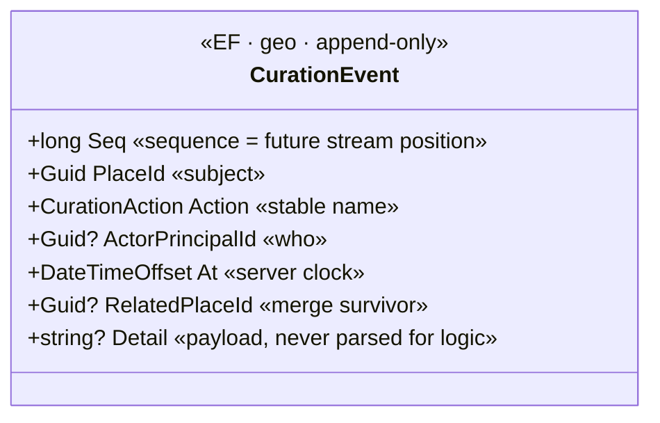

# Event sourcing — decision & conventions

**Status: LupiraGeoApi is not event-sourced.** This is deliberate, and most of the domain must never be. This doc
records *why*, the one thing captured now because it is unbackfillable (the curation log), and the conventions to
follow **if** place curation is ever promoted to a real event stream — so adoption is mechanical, not a rewrite under
pressure.

## What is and isn't event-worthy here

The rule (global): *Marten = event-worthy state; EF Core = synced read-only reference data; don't event-source mirrors.*
Applied to this context the domain splits three ways:

| Data | Store today | Event-source? | Why |
|---|---|---|---|
| Gazetteer base — `Place`/`AdminArea` imported from GeoNames/OSM | EF · `geo` | **Never** | A mirror of external reference data; rebuildable by re-import. |
| `GeocodeCache` | Marten doc · `geo_user` | **Never** | A cache; resolve-once-freeze, disposable. |
| `SavedPlace` | Marten doc · `geo_user` | Only with crypto-shred (see below) | Private per-principal PII; today a plain doc, so `Delete` is a true GDPR delete. |
| **Curation decisions** — verify / rename / alias± / merge on a `Place` | EF `curation_log` (audit) | **Candidate** | Human/system decisions layered over the imported base; **not** reconstructable from re-import. |

Only the last row is a real event-sourcing candidate. Forcing the first two into a stream would break the rule and buy
nothing.

## The proto-event-stream: `curation_log`

Curation decisions are the unbackfillable slice — *who* verified/renamed/aliased/merged a place, and *when*. That is
captured **now**, before real data accumulates, in an append-only EF table (`CurationEvent`, schema `geo`), written in
the **same transaction** as the change it describes (see `Application/CurationLog.cs`), so the trail can never drift
from the data.



It is write-only for now (no read endpoint — capture is the point; querying it is a later feature). When curation is
promoted to a Marten stream, these rows are the **replay seed**: `Action` already uses stable names, no derived values
are stored, and `Seq` gives a total order. `SavedPlace` is *not* logged — the owner is the actor, row timestamps
(`CreatedAt`/`UpdatedAt`) carry provenance, and an immutable surviving trail would fight GDPR hard-delete.

## Adoption path (when the trigger comes)

Promote curation to events only when a real requirement appears (undo/redo of curation, audit UI, temporal queries).
Then, mechanically:

1. Add a Marten event store on a **new** schema (e.g. `geo_events`) — do **not** reuse `geo_user` (keep it a doc store).
2. Model a `PlaceCuration` stream keyed by `PlaceId` with the events below; keep the EF `Place`/`PlaceAlias` tables as
   the **projected read model** (inline projection), so search/spatial queries are unchanged.
3. Backfill: replay `curation_log` rows (ordered by `Seq`) into the new streams.
4. Move cross-aggregate cleanup (merge → re-point `SavedPlace`) from the imperative service into a subscription.

Until then, the conventions below are the contract every future event must honour.

## Conventions

### Event type names — explicit, never CLR-derived
Register a stable wire name for every event so classes can be renamed/moved freely. Never rely on the type name.

```csharp
opts.Events.MapEventType<PlaceVerified>("place-verified");
opts.Events.MapEventType<PlaceMerged>("place-merged");
// The CurationAction enum names (Verified, Merged, …) are the canonical vocabulary — event names mirror them.
```

### Events are immutable value types
`sealed record` payloads, no behaviour, no navigation references that can dangle — carry ids, not entities. Store no
derived/denormalized values (no computed rollups, no hashes): compute those in projections, so a formula fix heals on
rebuild. Review each event for fields you'll wish existed — adding one later means an upcaster; a silent
nullable-default corrupts history.

### Upcasting — the convention, with a worked example
When an event must gain/rename a field, add a new versioned payload and an upcaster; never edit the old one.

```csharp
// v1 already in the store; v2 adds Reason.
public sealed record PlaceVerifiedV1(Guid PlaceId, Guid ActorId);
public sealed record PlaceVerified(Guid PlaceId, Guid ActorId, string? Reason);

public sealed class PlaceVerifiedUpcaster
    : Marten.Services.Json.Transformations.EventUpcaster<PlaceVerifiedV1, PlaceVerified>
{
    // Pure: only the old event's data → the new shape. Explicit default, never a silent null.
    protected override PlaceVerified Upcast(PlaceVerifiedV1 e) => new(e.PlaceId, e.ActorId, Reason: null);
}

opts.Events.MapEventType<PlaceVerified>("place-verified"); // same wire name across versions
opts.Events.Upcast<PlaceVerifiedUpcaster>();
```

### Determinism — replay must be pure
No wall-clock, `Guid.NewGuid()`, `Random`, culture-dependent formatting, or I/O inside any `Apply`/projection handler —
every input comes from the event. (Command-time code *may* use `UtcNow`/`NewGuid` — that's how `CurationLog.Record`
stamps `At` today; the ban is on the *apply/replay* side.) Every projection must rebuild from zero and be
order-independent within a stream.

### Provenance & metadata — capture at the store, once
Enable event metadata and populate it per request; it cannot be reconstructed later.

```csharp
opts.Events.MetadataConfig.EnableAll();      // CausationId, CorrelationId, Headers, UserName(LastModifiedBy)
// per request, before AppendEvent:
session.CorrelationId = activity.TraceId;    // ties events to the request/trace
session.CausationId  = commandId;
session.LastModifiedBy = principal.Id.ToString();  // the actor (mirrors CurationEvent.ActorPrincipalId)
```

### Tenancy
Single-tenant (one family). Streams are **principal-scoped by id**, not Marten tenanted. If this store ever goes
multi-tenant, the partition key is the OIDC `sub` (the only cross-service join key) — decide before, not after.

### Projections — inline vs async
The `Place` read model must be **inline** (a curation change must be queryable immediately). Anything eventually-
consistent (analytics, cross-aggregate cleanup) is **async** and needs the projection daemon running in prod
(`AddAsyncDaemon`) plus a rehearsed rebuild.

### Cross-aggregate cleanup = subscriptions, not imperative fan-out
Today `PlaceMergeService` re-points `SavedPlace`s imperatively across two stores (EF then Marten, not atomic,
convergent on re-run). Under ES this becomes a subscription: `PlaceMerged` → re-point saved places pointing at the
loser. Design cleanup as a subscription so dangling refs can't accrete.

### Optimistic concurrency
`SavedPlace` already uses Marten optimistic concurrency (`UseOptimisticConcurrency(true)`) — a concurrent edit between
load and save throws `JasperFx.ConcurrencyException`, mapped to `409 Conflict`. Curation streams should append with an
expected version where concurrent edits are plausible.

### API/DTO versioning ≠ event versioning
Wire DTOs (`Dtos/`) version with the HTTP API. Event payloads version independently via upcasters. Never share a type
between the two — a DTO change must not force an event migration, or vice-versa.

## Operations (already in place)
- Marten auto-schema-creation is **off** in prod (`AutoCreate.None`); dev self-applies. DDL is a deliberate
  `--apply-schema` step. An event store would join the same gate.
- Back up the whole `lupira_geo` DB and **test the restore** — this already covers the doc store and EF gazetteer; an
  event store raises the stakes (the log is the source of truth).
- Any future async projection needs a **rehearsed** rebuild (`daemon.RebuildProjectionAsync`) run against a restore
  before prod.
